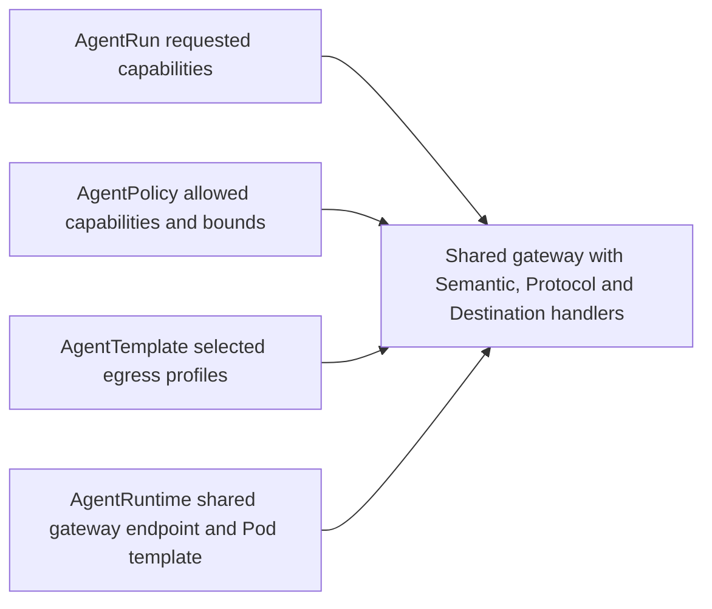

# Capabilities and gateways

**Audience:** operators, contributors

Sproozi does not treat permissions as a single allowlist. A capability becomes usable only when multiple layers agree.

## Mental model

The broker can enforce three levels of understanding, selected per operation:

| Tier | Enforced boundary | Example |
| --- | --- | --- |
| Semantic | Meaningful service resources and actions | Read pods in one namespace; create a PR from a run-owned branch |
| Protocol | A bounded service interface and request shape | Permit selected MCP tools with argument predicates |
| Destination | Exact network destinations and protocols | Permit HTTPS to one approved host |

CLI, HTTP proxy and MCP are delivery interfaces. The demo's `kubectl`, `git` and
`gh` calls are semantic requests because the broker checks their resources and
actions. Installing a tool grants no external authority. One run may use
different tiers, always within its statically declared capability envelope.

The [recorded demo](../demos/verified-sre-demo.md) exercised semantic paths. It
did not exercise protocol-only integrations, generic destination access, package
installation or MCP mediation.

- `AgentRun` asks for an explicit capability subset
- `AgentPolicy` says whether that subset is legal
- `AgentTemplate` adds trusted context such as selected egress profiles and instructions
- `AgentRuntime` tells the sandbox where the shared trusted gateway lives
- the gateway authenticates the run, then the selected handler enforces its capability and tier

## How capability grants become usable

### `model.inference`

`model.inference` requires live capability authorization. An optional
`AgentPolicy.spec.budgets[model.inference]` entry adds reservation and settlement
accounting. Model admission can underestimate total consumption; this accounting
is not a hard provider-spending ceiling.

### `network.egress`

`network.egress` only becomes useful when:

1. the run requests `network.egress`
2. the policy lists the profile name
3. the template also selects the same profile
4. the shared gateway destination module approves the exact destination tuple

### `github.pull_request`

The sandbox never gets GitHub credentials. It asks the shared gateway's GitHub
module to publish a PR, and that module validates the run, repository scope, and
revision contract first.

### `mcp.<server>`

A configured remote server becomes usable when the gateway registry contains its
approved HTTPS endpoint, the run requests its named capability, and current
policy allows that capability with an explicit tool scope. Discovery supplies
input schemas and descriptions. Optional policy argument predicates add scope;
the gateway validates both schemas independently and reports Protocol enforcement.
Provider credentials remain behind the gateway. Each incoming request owns a
private upstream session. Attempted tool calls charge the Run UID and named
capability account.

Native Kubernetes MCP instead uses `kubernetes.read` and the existing Semantic
handler. See [configured MCP capabilities](../reference/configured-mcp.md),
[Kubernetes MCP delivery](../reference/kubernetes-mcp.md) and
[ADR 0001](../adr/0001-mcp-capabilities-through-shared-gateway.md).

## Why this matters

This split keeps the agent flexible without making prompts the source of truth for authorization. Policy, RBAC, and gateways remain authoritative even if the sandbox is compromised or the task/event text is hostile.

The production story still depends on operator hardening around inspected TLS,
namespace isolation, GitHub-side protections, and durable gateway state. The
recorded semantic runs establish scoped historical acceptance, not production
readiness. See [Security hardening](../reference/security-hardening.md).

## Implementation map

The tiers describe how much a module understands about the permitted operation.
They are not transports and are not increasing permission levels.

| Tier | Module | Status |
| --- | --- | --- |
| Semantic | `internal/endpoints/kubernetes`, `internal/endpoints/github`, `internal/endpoints/model`, `internal/endpoints/packages` | Implemented |
| Protocol | `internal/endpoints/mcp` | Configured remote tools, discovered input schemas and additive policy predicates |
| Destination | `internal/endpoints/destination` | Inspected HTTPS to exact profile hosts and ports |

`internal/proxytransport` provides authentication, TLS inspection and session
revocation for all routed tiers. `Dispatcher` in `internal/gateway/dispatch.go` selects an exact
authority and records the route's enforcement tier in its static definition.
The MCP handler selects its named capability from the validated broker path.
Each handler still authorizes the actual operation against the run and live
policy and writes its tier in audit output.

Destination routes are derived from configured egress profiles. The inspection
certificate must cover every workload destination host. Registered remote MCP
authorities are reserved denied routes; their TLS is validated by the gateway
using ordinary upstream trust. Semantic service addresses are
reserved even when their module is disabled, so generic egress cannot provide a
weaker fallback. Raw CONNECT tunnels, plaintext HTTP and protocol upgrades are
unsupported. Model responses are deliberately buffered for usage verification;
the shared dispatcher itself preserves streaming response behaviour.

## Endpoint interface and spending

The gateway is the shared service. Each implementation lives beneath
`internal/endpoints` in service-specific subpackages and implements
`http.Handler`. There is no plugin lifecycle, custom forwarding interface, or
per-service executable. The dispatcher supplies the authenticated run and, for fixed native
capabilities, an optional `budget.Meter` in request context. The configured MCP
handler resolves the named capability and meter from the broker path and live
policy. Each handler authorizes the operation.

`internal/budget` owns the shared accounting contract and its memory and Kubernetes
storage adapters. `Meter.Spend` charges known usage before forwarding;
`Meter.Reserve` returns a reservation for variable usage, which the endpoint
settles or releases. Models translate provider-reported usage and administrator pricing into units
and cost. The current admission estimate can omit input tokens, and rejection
after an over-bound settlement does not undo upstream consumption. Other
native endpoints spend one unit per authorized upstream request, including each
GitHub read-back request. Configured MCP spends one unit before an upstream tool
invocation, including failed attempts. Its bounded initialization and discovery
are separate from tool-call spending.

## MCP evidence and further directions

[Recorded MCP acceptance](../demos/verified-mcp-demo.md) covers native Kubernetes
and two configured HTTPS fixture providers through stock Codex, including scope,
budget and network denials, cancellation and normal cleanup. The
[interoperability design](future-architecture/capabilities-and-mcp.md) describes
future managed servers and stronger semantic bindings. Ordinary CLI and HTTP
delivery remain available alongside the implemented MCP paths.
