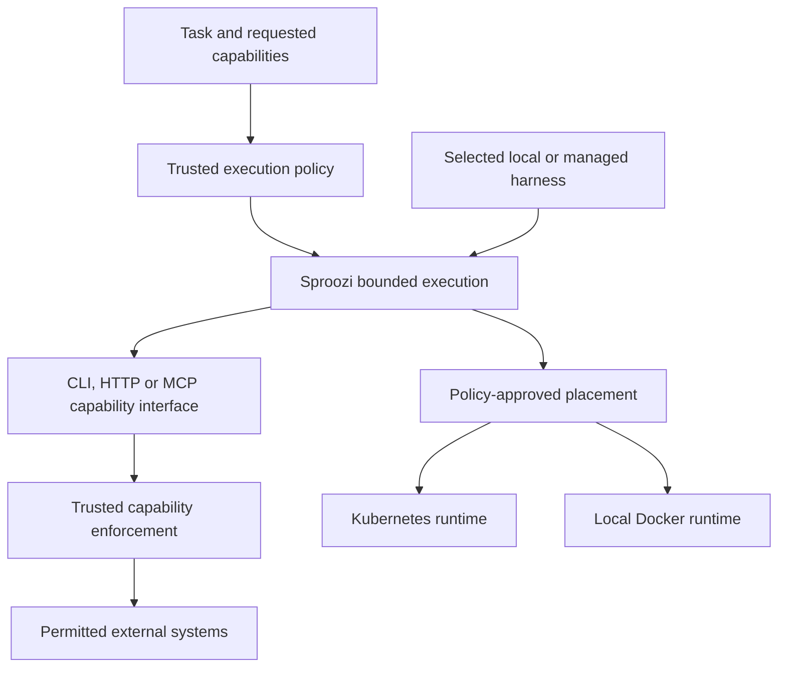

# Future architecture

**Audience:** contributors, operators evaluating future directions

**Status:** directional design. The first [native Kubernetes MCP tool](../../reference/kubernetes-mcp.md)
is implemented with local proxy tests and bounded Kind acceptance.
[Configured remote MCP tools](../../reference/configured-mcp.md) now have local
protocol/configuration checks and bounded Kind acceptance with two fixture
providers. [ADR 0001](../../adr/0001-mcp-capabilities-through-shared-gateway.md)
records the MCP integration decision. Other extensions remain directional.

Sproozi brokers execution. Given a task and an authorised capability envelope,
it should prepare a disposable environment, bind identity and policy, connect
only the permitted systems, observe the execution and revoke its authority.
Tool routing is part of that job. The unit of the product is the bounded run.

The current Kubernetes/SRE work is the first hard proof of this model. An
unmodified agent can investigate real infrastructure and propose a correction
through familiar clients while the trusted gateway controls external authority.
The extensions here evolve that boundary. They do not replace the SRE work or
require a new agent framework.

## Three independent choices

| Direction | Question | What it should establish |
| --- | --- | --- |
| [Capabilities and MCP](capabilities-and-mcp.md) | What may the execution do, and through which interface? | Existing capability ecosystems can supply useful operations under Sproozi policy. |
| [Execution runtimes](execution-runtimes.md) | Where and how does the environment run? | Local Docker and Kubernetes can implement the same execution intent. |
| [Harness portability and control](harness-portability.md) | Which system drives the agent loop? | Different local or managed harnesses can use Sproozi-owned execution. |

This is a responsibility diagram, not a proposed deployment layout. The harness,
capability interface and runtime should become independently swappable. Changing
Codex to Claude Code should not redefine repository permissions. Delivering a
capability through MCP should not choose where the workload runs. Choosing
Docker should not grant broader egress.

Policy sits above placement and runtime. A placement preference chooses among
implementations that can satisfy the approved bounds. It cannot relax those
bounds to make a run start. Some combinations will be unsupported, and some
policies should permit only a particular execution location.

## Current foundation and remaining coupling

The [system architecture](../system-architecture.md),
[capability explanation](../capabilities-and-gateways.md) and
[run lifecycle](../run-lifecycle.md) describe the implementation. These documents
remain authoritative for current behaviour.

| Existing foundation | Evidence in the repository | Extension still needed |
| --- | --- | --- |
| Requested authority and trusted configuration are separate | [AgentRun](../../reference/agentrun.md), [AgentTemplate](../../reference/agenttemplate.md), [AgentPolicy](../../reference/agentpolicy.md) | Preserve that distinction across local and managed entry points. |
| A replaceable execution client exists | `internal/kubernetes/sandbox.go` defines `SandboxClient` and `PodSandboxClient` | The client still accepts Kubernetes API types; it is not a portable runtime contract. |
| Admission and lifecycle control are outside the workload | `internal/controller/reconciler.go`, `internal/policy/evaluator.go` | Identity, resource validation, provisioning and status still depend on Kubernetes. |
| Delivery and semantic enforcement are separate | `internal/gateway/dispatch.go`, `internal/endpoints`, `internal/proxytransport` | Native Kubernetes MCP shares semantic enforcement; configured remote MCP provides Protocol mediation. Managed servers remain future work. |
| The agent reads a bounded input contract | `internal/agentcontract/contract.go`, [agent contract](../../reference/agent-contract.md), `internal/harness` | The controller renders native Codex, Claude Code and OpenCode MCP connections; trusted launch commands load them. See [current harness support](../../reference/harnesses.md). |

The current `AgentRuntime` owns a Pod template and gateway configuration. Its
name must not be read as evidence of Docker support or a separate harness
registry. The target separation describes responsibilities, not additional CRDs,
a fixed plugin framework or interfaces that already exist.

[Recorded SRE acceptance](../../demos/verified-sre-demo.md) covers historical
semantic Kubernetes, GitHub and model requests, denial probes and scoped cleanup.
It does not establish MCP, Docker, other harnesses, deployed recovery or release
reproducibility. The current limits remain in
[security hardening](../../reference/security-hardening.md). Future design goals
must not be presented as guarantees of today's preview.

## Invariants to carry forward

- Trusted configuration selects the permitted environment and capabilities.
  Task text, event evidence and repository configuration cannot promote themselves
  into policy or grant additional authority.
- The workload receives run identity. Provider authority remains in the trusted
  boundary, with any weaker delegation explicitly described and authorised.
- Capability checks combine the immutable request with current policy and
  lifecycle state. Discovery, installed tools and harness approvals do not grant
  external authority.
- Cancellation and deadlines revoke authority and stop execution. Retries and
  restart recovery must converge on cleanup of resources owned by that run.
- Evidence should identify the requested and granted capability, scope, actual
  enforcement tier, placement and terminal outcome without recording secrets or
  sensitive workload content.

These are requirements for the extensions. Their full implementation and
verification are separate work, especially recovery after partial provisioning.

## A sequence of small proofs

Keep the Kubernetes/SRE path as the baseline. One policy-controlled native MCP
tool is now implemented and available through opt-in trusted Codex configuration.
Its [recorded Kind acceptance](../../demos/verified-mcp-demo.md) demonstrates
stock Codex tool use, network and scope denials, cancellation and scoped cleanup.
Configured remote MCP providers and declarative argument scope are also
implemented without per-provider Go adapters. A recorded remote MCP Kind run
proves stock Codex use of two configured HTTPS fixture providers. Local Docker
would be a separate execution proof with the same bounded capability. Add a
second CLI harness to show that neither proof depends on Codex. Each can be
useful before the full target matrix exists.

Remote or managed harness control is a later, separate proof. An external system
owns the loop while Sproozi owns its execution environment. Together, Docker
shows that Sproozi is not Kubernetes-only, and managed harness integration shows
that Sproozi does not need to be an agent framework. MCP is the last-mile
capability protocol, not the product.

This sequence is a suggested way to test the boundaries, not a release schedule.
Avoid making the initial release wait for all combinations. Define concrete
interfaces only when the next implementation needs them; prove one seam at a
time through allowed work, denied work and lifecycle cleanup.
