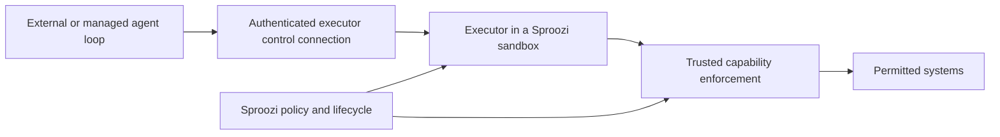

# Harness portability and control

**Status:** future direction. The stock Codex SRE path is the demonstrated
baseline. Other harnesses and managed control need separate verification.
See the [overview](README.md).

A harness owns the agent loop, model interaction, context and its user
experience. Sproozi owns the bounded execution environment and the external
authority available to work performed there. The model provider is another
choice: supporting a harness does not automatically make its authentication or
model traffic compatible with the current gateway.

The preferred first integration is to launch an existing CLI in the selected
sandbox and let it use its local tool executor there. Keep the harness intact.
A deeper integration should solve a demonstrated requirement for remote control,
managed sessions or structured interaction, and remain a distinct direction.

## Launch the CLI before integrating the loop

A small harness adapter should prepare the harness's trusted launch settings,
provide the task and event evidence as data, render approved capability
connections, and start the process in the approved workspace. Interactive use
can attach a terminal. Automated runs should use a supported bounded mode with
observable completion.

The runtime adapter creates and observes the environment; the harness adapter
chooses how the selected CLI runs in it. A harness's local shell or file executor
should operate inside that environment. If the harness selects a separate
executor, Sproozi must establish that it targets the approved sandbox. Passing
host Docker access or launching commands on the caller's laptop would escape
the execution boundary.

Harness-native approvals may further restrict work, but cannot grant an action
that Sproozi policy denies. A harness does not need to understand Sproozi's
semantic policy to be contained by it. Installation alone is not compatibility:
model connections, subprocesses, configuration loading and lifecycle behaviour
must all work within the enforced boundary.

The current [agent contract](../../reference/agent-contract.md) separates trusted
instructions from untrusted task and event context. It is input, not a model
session protocol. The stock runtime command in `examples/sre-demo/agentruntime.yaml`
launches `codex exec`; there is no common harness registry or launch abstraction
in the current code. Its exit status determines lifecycle success, independently
of PR or task-quality evidence.

## Target harnesses

The entry points below come from official documentation checked on 6 October
2026. They identify candidate launch paths, not a tested Sproozi support matrix
or final adapter commands. Pin versions and verify each integration before
adding it to [client compatibility](../../reference/client-compatibility.md).

| Harness | Preferred first path | Boundary to establish |
| --- | --- | --- |
| Codex | Extend the existing stock CLI path to Docker and generated capability configuration. | Preserve its proxy/trust and model transport settings; interactive mode needs separate acceptance from the existing one-shot SRE run. |
| Claude Code | Launch the CLI, with print mode for bounded work and run-local MCP configuration. [CLI reference](https://code.claude.com/docs/en/cli-reference). | Verify model authentication and transport, approved configuration loading, approval behaviour and process outcome. |
| GitHub Copilot | Start with Copilot CLI's interactive or programmatic interface. [CLI concepts](https://docs.github.com/en/copilot/concepts/copilot-surfaces/copilot-cli). | Constrain loaded tools and credentials, including built-in integrations. CLI support does not establish IDE or cloud-agent support. |
| OpenCode | Use its CLI and non-interactive run path in the approved environment. [Commands](https://opencode.ai/v2/docs/cli/commands/). | Establish where its execution server and tools run, and how provider and MCP connections stay inside the approved boundary. |
| OpenClaw | Evaluate its local one-shot agent mode before connecting a persistent Gateway. [Agent CLI](https://docs.openclaw.ai/cli/agent). | Use isolated run state and local execution. Messaging channels, persistent sessions and Gateway control need their own scope and lifecycle. |
| Hermes | Launch the CLI, using single-query mode for bounded work. [CLI interface](https://hermes-agent.nousresearch.com/docs/user-guide/cli/). | Select the tool execution backend deliberately; isolate memory, configuration and optional messaging or scheduled services from the bounded run. |

These are targets, not a requirement to build six deep integrations before the
first portability proof. Codex plus one additional CLI harness is enough to test
the separation. Persistent OpenClaw or Hermes assistants may later submit
bounded work to Sproozi while retaining their own memory and channel state.
Hosting their full persistent service is a different lifecycle from an AgentRun.

## Configuration adapters belong at launch

[Capability preparation](capabilities-and-mcp.md) resolves approved operations
and connections. The harness adapter translates those into the selected CLI's
supported configuration. Do not assume one MCP configuration file works for all
harnesses or confuse tool discovery with capability authority.

Keep configuration local to the run. User-global settings, repository hooks,
plugins, preconfigured servers, credential helpers and existing sessions must
not introduce ambient authority. Repository instructions can help the agent do
its task but cannot select a broader policy. The adapter should report
unsupported combinations rather than inherit host settings until the CLI works.

Model-provider access needs its own mediated path and compatibility evidence.
Today's gateway and recorded Codex configuration support particular HTTP model
protocols; they are not evidence that Claude, Copilot or every OpenCode/Hermes
provider will work. Preserve the existing budget limitations and avoid describing
harness-side cost controls as Sproozi spending guarantees.

## Remote execution and remote harness control are different

A CLI running in a Kubernetes Pod is remote execution with the agent loop in
the sandbox. It can use the same launch adapter as a local Docker container.
Moving that workload does not require an API integration with the harness.

With remote harness control, the loop lives elsewhere and sends commands or
tool requests to an executor in a Sproozi environment. The external service may
own session history, context compaction and user interaction. Sproozi must still
own placement, identity, grants, deadlines, cancellation and environment cleanup.
This division proves that Sproozi need not become an agent framework.

A concrete candidate is the OpenAI Agents API's
[self-hosted environment model](https://developers.openai.com/api/docs/guides/agents-api/environments/self-hosted).
Its documentation describes an OpenAI-managed Codex loop and a `codex exec-server`
executor in user-owned compute, connected outbound over WebSocket. It separates
the application's API key from the restricted environment connection key.
This is evidence for the integration direction, not an implemented Sproozi
adapter or a promise that the standard Codex cloud UI can select a Sproozi cluster.

The current proxy rejects protocol upgrades, including WebSockets. Supporting
that control channel therefore needs a deliberate authenticated and bounded
transport design. A generic egress grant would not by itself establish safe
remote control. Keep executor connection authority separate from model-provider
and target-system credentials.

## What deeper integration must resolve

An executor can stay alive across turns. Its process exit cannot automatically
stand in for completion of one task, unlike the current one-shot CLI convention.
Before integrating a managed loop, establish:

- How the remote session and executor bind to a Sproozi execution, and whether
  one bounded run covers one turn or a longer approved session.
- Which events establish terminal execution outcomes, independently of task
  artefacts, and who is responsible for stopping an idle executor.
- How cancellation, deadline expiry and policy revocation stop remote work,
  close connections and remove access even during disconnection or reconnection.
- How retries avoid duplicate work, how stale commands are rejected, and how
  lost control-plane state is reconciled with owned sandbox resources.
- Which files, results and session state leave the environment, and what audit
  attribution remains available when the loop is external.

Sproozi should adapt to the harness's existing control protocol and session
ownership. It should not invent a common agent conversation protocol, reproduce
context compaction, or become the owner of every harness's approval UI.

SDK, server or API integration may eventually help a target harness submit work,
attach an external UI or reuse a managed loop. Those capabilities should be
added separately from its CLI-spawn adapter. No specific SDK, schema, endpoint
set or persistent-session design is committed here.

## Proof of portability

For a second CLI harness, verify approved task delivery, scoped capability use,
out-of-scope and direct-access denials, real exit status, cancellation and cleanup.
Where MCP is part of that run, verify that the same capability grant works after
only the harness configuration changes. Reuse the runtime and policy proof;
avoid adding a new permission model for each CLI.

For a later managed integration, demonstrate the loop outside the sandbox and
exercise disconnection, reconnection, revocation and explicit task completion.
A successful remote command alone is insufficient evidence of lifecycle control.
Keep each verified combination visible alongside its limitations rather than
claiming every harness, runtime and provider combination is interchangeable.
