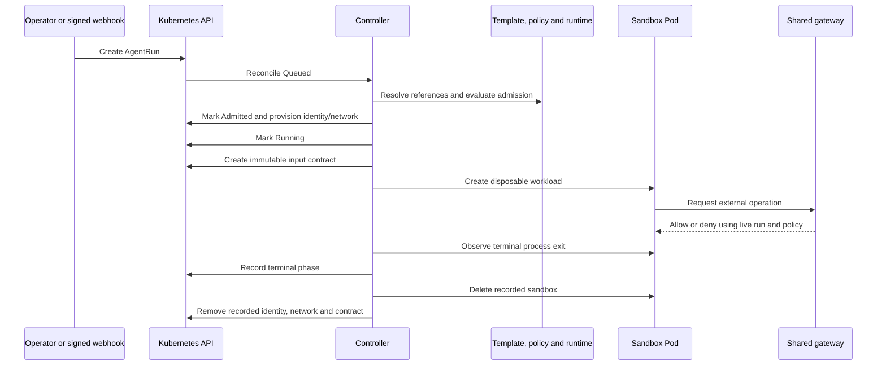

# Run lifecycle

An `AgentRun` records one requested execution and its immutable capabilities,
untrusted task and event context. The template, policy and runtime are
administrator-owned.



## Phases and admission

```text
Queued -> Admitted -> Running -> Succeeded | Failed | TimedOut | Cancelled
```

Admission resolves references, checks requested capabilities and resources, and
provisions a dedicated ServiceAccount and NetworkPolicy. The controller creates
an immutable contract ConfigMap and the runtime-derived Pod. It does not create
per-run target-namespace Roles or RoleBindings. The ServiceAccount has no direct
Kubernetes grant; the shared gateway authorizes Kubernetes reads.

## Completion

The Pod adapter waits for the whole Pod to become terminal, then reads the exit
code of the container named `agent`. Zero means `Succeeded`; non-zero or unavailable
exit means `Failed`. Use one workload container with that name. Long-running
ordinary sidecars prevent completion. A PR or agent summary is separate task
evidence, not the lifecycle success condition.

Explicit cancellation and deadline expiry record `Cancelled` or `TimedOut` and
start Pod cleanup. They do not depend on the agent reporting an outcome.

## Cleanup and retention

Normal terminal handling and explicit deletion remove the recorded Pod before
releasing its contract ConfigMap, NetworkPolicy and ServiceAccount. The Run record
remains until the policy's `retentionTTL` expires unless explicitly deleted.

Cleanup relies on identity fields persisted in status. Lost provisioning status
writes can leave resources behind, including a running Pod whose NetworkPolicy
is removed. The normal cleanup path is therefore not a guarantee of recovery
from partial provisioning. Budget ConfigMaps and unique webhook replay records
also have no automatic retention cleanup. See
[security hardening](../reference/security-hardening.md).

## Gateway revocation

One projected gateway-audience token has a two-hour lifetime; policy bounds
execution to one hour. The demo reads the token once. Token expiry is not the
revocation boundary. New requests check active Run identity and policy; existing
sessions close through bounded revalidation. The workload has no Sproozi proxy
sidecar or local proxy process.

[Recorded acceptance](../demos/verified-sre-demo.md) covers successful semantic
runs and scoped sandbox cleanup. It does not cover partial-provisioning recovery.
