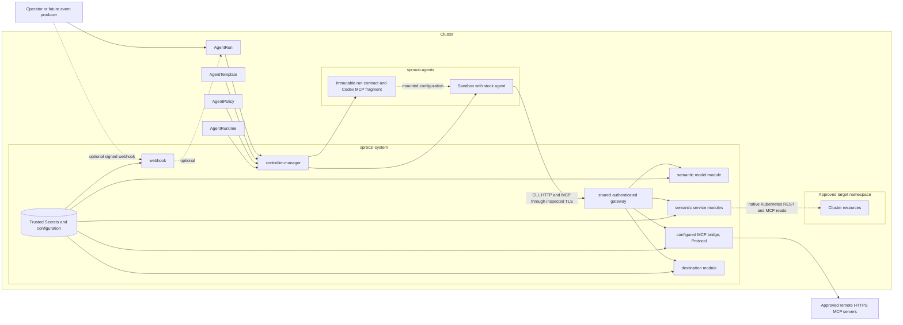

# System architecture

**Audience:** operators, contributors

Sproozi separates untrusted agent execution from trusted policy and credential
handling. CLI, HTTP and MCP clients use one shared authenticated gateway. Its
native service handlers enforce Semantic scope, the configured MCP bridge
provides Protocol mediation, and the destination handler checks exact network
destinations. These tiers describe the broker's understanding of an operation.

## Trust and namespace boundaries

- `sproozi-system` holds the trusted controller, webhook and shared gateway,
  including Semantic, Protocol and Destination handlers and provider credentials.
- `sproozi-agents` holds run-scoped identities, network policies, immutable
  contracts and untrusted sandbox workloads.
- Approved target namespaces such as `sproozi-demo` hold resources the run may inspect.
- Task text, event payloads and provider output are untrusted. Tool discovery
  describes an interface; trusted registration and policy determine authority.

## External-call invariant

With an enforcing CNI and the generated NetworkPolicy, external calls from a
workload, including Kubernetes API and MCP calls, go through the shared gateway.
The generated policy grants only DNS and gateway egress. Operators must verify
direct API/provider denials in their environment; NetworkPolicy alone has
node-traffic exceptions. Routing selects a handler. The handler authorizes the
actual operation against immutable requested capabilities and current
lifecycle/policy state.

Each run gets one dedicated ServiceAccount. Its gateway-audience token identifies
the run but does not grant capabilities. The workload Pod has no Sproozi proxy
sidecar or local proxy process. Provider credentials remain in the trusted gateway.

## MCP is a supported capability interface

| Path | Run grant | Trusted configuration | Enforcement |
| --- | --- | --- | --- |
| Native Kubernetes Pod-list tool at `https://kubernetes.default.svc/mcp` | `kubernetes.read` | Existing Kubernetes namespace/resource policy | Semantic, through the same handler as native REST reads |
| Registered remote tools at the gateway's `/mcp/<server>` path | `mcp.<server>` | Gateway registry plus `AgentPolicy.spec.mcpServers` tool rules and optional argument restrictions | Protocol, using discovered input schemas and independent policy validation |

Adding a compatible remote HTTPS server requires registration and policy, without
a provider-specific Go adapter. The gateway snapshots exact provider URLs and
optional bearer credential files at startup. Registration or credential changes
require a gateway restart; policy remains live. Provider authorities are reserved
against weaker destination routing.

For each incoming remote MCP request, the bridge initializes a private upstream
SDK session, discovers and filters approved tools, executes at most one call and
closes the session. Budgets charge attempted tool invocations under the Run UID
and named capability; reconnecting does not reset consumption. Cached discovery
and connection configuration grant no authority. The proxy's live revalidation
revokes requests when run or policy authority ends.

The controller renders native Codex, Claude Code or OpenCode MCP configuration
in the immutable run contract. The administrator-owned launch loads it into
fresh client state, with no upstream URLs or credentials. Claude Code's native
Anthropic model route shares the existing `model.inference` account with OpenAI;
the trusted gateway selects its protocol and credentials. The [harness reference](../reference/harnesses.md)
and [harness ADR](../adr/0002-native-cli-harnesses-and-model-protocols.md)
describe launch, completion, accounting and verification limits.

The [MCP ADR](../adr/0001-mcp-capabilities-through-shared-gateway.md) records why
registration, grants and session ownership have this shape. See
[configured MCP capabilities](../reference/configured-mcp.md),
[native Kubernetes MCP delivery](../reference/kubernetes-mcp.md) and
[the agent contract](../reference/agent-contract.md) for current configuration and
limits. The configured bridge supports independent HTTPS tool operations;
managed stdio, OAuth consent and conversation continuity remain future work.

## Execution and evidence

The execution adapter creates Pods, not external Agent Sandbox custom resources.
A run receives an immutable input contract, one projected gateway-audience token,
a ServiceAccount without direct Kubernetes grants, and a run-scoped NetworkPolicy.
The token identifies the run; requested capabilities and live policy determine
its authority. New gateway requests recheck that authority, and open sessions
close through bounded revalidation.

[Recorded SRE acceptance](../demos/verified-sre-demo.md) demonstrated the Semantic
Kubernetes, model and GitHub paths in Kind on 4 October 2026.
[Recorded MCP acceptance](../demos/verified-mcp-demo.md) demonstrated stock Codex
use of native Kubernetes MCP and two configured HTTPS fixture providers on
6 October 2026, including denials, budgets, cancellation and normal cleanup.
These dirty-tree runs establish neither universal provider compatibility nor
release reproducibility or home-ops integration. Current model admission,
interrupted cleanup and container-completion limitations are listed in
[security hardening](../reference/security-hardening.md).

## Future architecture

The [future architecture overview](future-architecture/README.md) describes
extensions to these implemented boundaries. MCP delivery and configurable HTTPS
provider mediation are current capabilities. Docker placement, managed harness control and managed MCP servers remain
directional designs. Additional stock CLI configuration and Anthropic Messages
are implemented, with local verification described in the harness reference.
