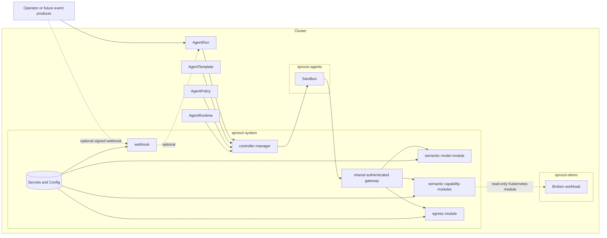

# System architecture

**Audience:** operators, contributors

Sproozi separates **untrusted agent execution** from **trusted policy and credential handling**.

## Trust boundaries

- **Trusted:** controller-manager, webhook, shared gateway and its semantic modules
- **Untrusted:** task text, event payloads, sandbox execution

## Namespace boundaries

- `sproozi-system` holds trusted workloads and credentials
- `sproozi-agents` holds run-scoped identities, network policies, and sandbox workloads
- target namespaces such as `sproozi-demo` hold the cluster resources the run may inspect

## External-call invariant

With an enforcing CNI and the generated NetworkPolicy, external calls from a workload, including Kubernetes API calls made by
`kubectl`, should go to the shared authenticated gateway. The generated policy
grants only DNS and gateway egress. Operators must verify direct API/provider
denials in their environment; NetworkPolicy alone has node-traffic exceptions.
Routing selects a module;
the module still authorizes the normalized operation against the run's
immutable requested capabilities and current lifecycle/policy state.

Each run gets one dedicated ServiceAccount. Its gateway-audience token identifies
the run but does not grant capabilities. The workload Pod has no Sproozi proxy
sidecar or local proxy process.

## Current-state note

The execution adapter creates Pods, not external Agent Sandbox custom resources.
A run receives an immutable input contract, one projected gateway-audience token,
a ServiceAccount without direct Kubernetes grants, and a run-scoped NetworkPolicy.
The token identifies the run; requested capabilities and live policy determine
its authority. New gateway requests recheck that authority, and open sessions
close through bounded revalidation.

[Recorded acceptance](../demos/verified-sre-demo.md) demonstrated the semantic
Kubernetes, model and GitHub path in Kind on 4 October 2026. Those dirty-tree
runs do not establish release reproducibility or home-ops integration. Current
model admission, interrupted cleanup and container-completion limitations are
listed in [security hardening](../reference/security-hardening.md).

## Future architecture

The [future architecture overview](future-architecture/README.md) describes
evolution toward independent capability interfaces, execution runtimes and
harnesses. Kubernetes/SRE remains the first proof; Docker, MCP and managed
harness control are directional extensions rather than current support.
