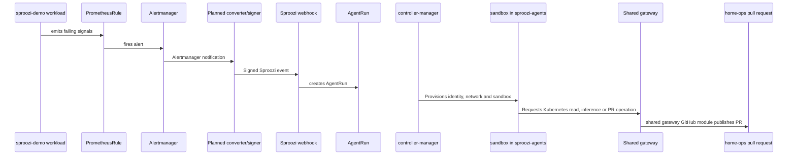

# Home-ops playbook

**Audience:** operators

This guide is the concrete playbook for adding Sproozi to [`andrewmccall/home-ops`](https://github.com/andrewmccall/home-ops). It stays separate from the core docs so the product model is not coupled to one personal GitOps repository.

This is a planned integration. The recorded manual Kind runs did not exercise
Alertmanager delivery, a home-ops PR or Flux recovery.

## Outcome

You will add:

1. a Sproozi app bundle under `cluster/apps/sproozi/`
2. SOPS-managed Secrets and supporting config for the shared gateway modules
3. the SRE demo stack and broken demo workload
4. Alertmanager rule and routing changes under `cluster/apps/monitoring/alerts/`

## Expected home-ops layout

Use these paths as the concrete playbook shape:

| Path | Purpose |
| --- | --- |
| `cluster/apps/sproozi/` | Sproozi app bundle, namespaces, CRs, ConfigMaps, and SOPS-managed Secrets |
| `cluster/apps/monitoring/alerts/prometheus-rules.yaml` | demo alert rule |
| `cluster/apps/monitoring/alerts/alertmanager-config.yaml` | route to the Sproozi webhook receiver |

## 1. Publish a pinned Sproozi release artifact

From this repository:

```sh
export IMG=<registry>/sproozi:<tag>
make docker-build docker-push IMG=$IMG
make build-installer IMG=$IMG
```

Commit or reference the resulting `dist/install.yaml` from `home-ops` at a pinned tag or revision.

## 2. Add a new Sproozi app bundle

Create `cluster/apps/sproozi/` and add the files that own:

- `sproozi-system`, `sproozi-agents`, and `sproozi-demo` namespaces
- the pinned Sproozi install bundle
- `AgentRuntime`, `AgentPolicy`, and `AgentTemplate`
- the demo workload
- trusted-service configuration

A practical starter set is:

- `cluster/apps/sproozi/kustomization.yaml`
- `cluster/apps/sproozi/namespaces.yaml`
- `cluster/apps/sproozi/sproozi-install.yaml`
- `cluster/apps/sproozi/agentruntime.yaml`
- `cluster/apps/sproozi/agentpolicy.yaml`
- `cluster/apps/sproozi/agenttemplate.yaml`
- `cluster/apps/sproozi/demo-workload.yaml`
- `cluster/apps/sproozi/egress-gateway-profiles.yaml`
- `cluster/apps/sproozi/model-gateway-credentials.sops.yaml`
- `cluster/apps/sproozi/capability-proxy-github-app.sops.yaml`
- `cluster/apps/sproozi/alertmanager-secret.sops.yaml`

## 3. Add SOPS-managed secrets and config

`home-ops` should own the real trusted-service inputs:

- `Secret/model-gateway-credentials` in `sproozi-system`
- `Secret/capability-proxy-github-app` in `sproozi-system`
- `ConfigMap/egress-gateway-profiles` in `sproozi-system`
- `Secret/sproozi-gateway-tls` with managed inspection TLS in `sproozi-system`
- immutable `ConfigMap/sproozi-sandbox-trust` in `sproozi-agents`, referenced by the runtime's client trust configuration
- the model pricing and authentication configuration described in [required secrets and config](../reference/required-secrets-and-config.md)
- one random per-template HMAC Secret with key `hmac-key` in the template namespace

Keep static credentials in SOPS-managed manifests in `cluster/apps/sproozi/`.
For ChatGPT authentication, the gateway owns the rotating live session Secret;
do not reconcile it from a stale bootstrap file. See
[model provider authentication](model-provider-auth.md).

## 4. Add the SRE demo stack

The first `home-ops` template should:

- reference exactly one runtime and one policy
- label the template with `sproozi.com/webhook-receiver=alertmanager`
- annotate the template with `sproozi.com/webhook-secret=<secret-name>`
- target `andrewmccall/home-ops` for `github.pull_request`
- target `sproozi-demo` for `kubernetes.read`

## 5. Add the broken demo workload

Place the workload under `cluster/apps/sproozi/` in `sproozi-demo`. The verified
manual scenario uses `exit 1`, which produces `CrashLoopBackOff`. An invalid image
tag instead produces `ImagePullBackOff`.

Adapt trusted template instructions to the home-ops path
`cluster/apps/sproozi/demo-workload.yaml` and bounded `gh api` REST PR creation.
The local example and acceptance suite expect repository-root `demo-workload.yaml`;
do not run that suite against home-ops unchanged.

## 6. Wire alerting under monitoring

Keep monitoring-owned changes in `cluster/apps/monitoring/alerts/`:

- add a `PrometheusRule` that selects the demo workload
- route an `AlertmanagerConfig` notification to a converter/signing adapter
- have that adapter POST the signed event to `http://sproozi-webhook.sproozi-system.svc.cluster.local:8083/webhook/<namespace>/<receiver>`

The adapter must translate Alertmanager notifications into `{id,eventContext}`
and sign the timestamp plus exact request bytes with the per-template HMAC key.
This repository implements the [signed receiver contract](../reference/webhook-contract.md),
but supplies no Alertmanager converter/signer. That adapter and full alert-to-PR
acceptance remain to be completed.

Make sure the namespace hosting the sender is allowed by the webhook NetworkPolicy label contract:

```yaml
metadata:
  labels:
    sproozi.com/webhook-client: enabled
```

## 7. Reconcile and observe the proof path



After Flux reconciliation, watch:

```sh
kubectl get deploy -n sproozi-system
kubectl get agenttemplates.sproozi.com -n sproozi-system
kubectl get agentruns.sproozi.com -A
kubectl get pods -n sproozi-agents
```

## Scope of this playbook

This guide is intentionally concrete about `home-ops` repository layout. The
product-wide object model, shared-gateway design, and capability semantics stay
in the core docs so they remain reusable outside that one GitOps repo. The
layout remains planned until a report from the actual home-ops integration proves
signed alert delivery, the scoped PR, boundary denials and cleanup. Record Flux
recovery separately after human review and merge.
